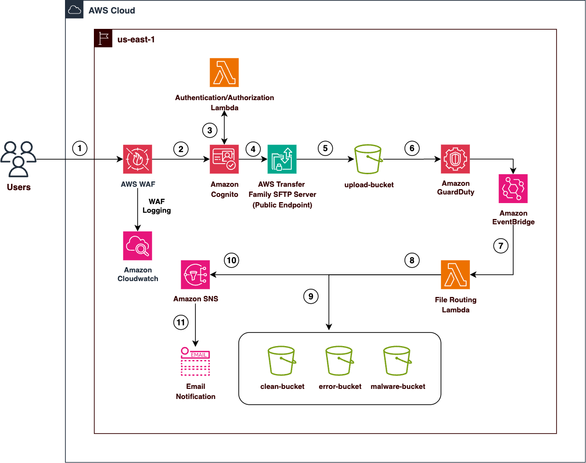

# WAF + AWS Transfer Family + GuardDuty Malware Scanning Solution

A comprehensive CloudFormation template that deploys a secure file transfer solution with automated malware scanning and intelligent file routing.

## 🏗️ Architecture Overview

  <p align="center">
    
  </p>

This solution provides:
- **Secure SFTP Server** with Cognito authentication via AWS Lambda
- **WAF Protection** against common web attacks with comprehensive logging
- **Automated Malware Scanning** using GuardDuty Malware Protection for S3
- **Intelligent File Routing** based on scan results via EventBridge and Lambda
- **Real-time Notifications** for security incidents via SNS
- **KMS Encryption** for all S3 buckets with automatic key rotation
- **Comprehensive S3 Access Logging** with dedicated logging buckets
- **Lifecycle Management** for cost optimization and data retention
- **Enhanced WAF Rules** including IP reputation and anonymous IP filtering

## Data Flow

1. **User Authentication Request**

- Users initiate SFTP connection to AWS Transfer Family server
- WAF inspects incoming requests for malicious patterns, rate limiting, and known bad inputs

2. **WAF Protection Layer**

- WAF WebACL applies security rules (rate limiting, common rule sets, known bad inputs)
- Legitimate requests proceed; malicious requests are blocked
- All WAF activity is logged to CloudWatch Logs

3. **Cognito Authentication**

- Authentication Lambda function validates user credentials against Cognito User Pool
- Lambda returns user role and home directory permissions if authentication succeeds

4. **Transfer Family SFTP Server**

- Authenticated users connect to public SFTP endpoint
- Users can upload files to their designated home directory

5. **File Upload to S3**

- Files are uploaded to the upload-bucket with KMS encryption
- S3 bucket policies restrict access to authorized Lambda functions only

6. **GuardDuty Malware Scanning**

- GuardDuty automatically scans uploaded files for malware
- Scan results are generated (NO_THREATS_FOUND, THREATS_FOUND, UNSUPPORTED, etc.)

7. **EventBridge Event Routing**

- GuardDuty publishes scan results to EventBridge
- EventBridge rule captures malware scan events and triggers File Routing Lambda

8. **File Routing Lambda Processing**

- Lambda function processes scan results and routes files based on status:
  - Clean files → clean-bucket
  - Malware files → malware-bucket
  - Error/unsupported files → error-bucket

9. **File Movement & Cleanup**

- Files are copied to appropriate destination bucket with KMS encryption
- Original files are deleted from upload-bucket
- File metadata and scan results are preserved

10. **SNS Notification (if malware detected)**

- For malware detections, Lambda publishes alert to SNS topic
- SNS sends email notifications to security team

11. **Email Alert Delivery**

- Security team receives immediate email notification with:
- File name
- Threat details

## 📋 Prerequisites

- AWS Account with appropriate permissions
- **GuardDuty enabled** in your AWS account
- **GuardDuty Malware Protection for S3** enabled
- Valid email address for security notifications

## 🚀 Quick Start

### 1. Deploy the Stack

```bash
aws cloudformation create-stack \
  --stack-name malware-scanning-sftp \
  --template-body file://waf-transfer-family-template.yml \
  --parameters ParameterKey=SecurityTeamEmail,ParameterValue=your-email@company.com \
  --capabilities CAPABILITY_NAMED_IAM
```

### 2. Create Cognito Users

After deployment, create users in the Cognito User Pool:

```bash
# Get the User Pool ID from stack outputs
USER_POOL_ID=$(aws cloudformation describe-stacks \
  --stack-name malware-scanning-sftp \
  --query 'Stacks[0].Outputs[?OutputKey==`UserPoolId`].OutputValue' \
  --output text)

# Create a user
aws cognito-idp admin-create-user \
  --user-pool-id $USER_POOL_ID \
  --username user@company.com \
  --user-attributes Name=email,Value=user@company.com \
  --temporary-password <*********> \
  --message-action SUPPRESS

# Set permanent password
aws cognito-idp admin-set-user-password \
  --user-pool-id $USER_POOL_ID \
  --username user@company.com \
  --password <*********> \
  --permanent
```

### 3. Connect via SFTP

```bash
# Get the Transfer Server Endpoint from stack outputs
TRANSFER_ENDPOINT=$(aws cloudformation describe-stacks \
  --stack-name malware-scanning-sftp \
  --query 'Stacks[0].Outputs[?OutputKey==`TransferServerEndpoint`].OutputValue' \
  --output text)

# Connect via SFTP
sftp user@company.com@$TRANSFER_ENDPOINT
```

## 📊 File Processing Flow

1. **Upload** → Files uploaded to upload bucket with KMS encryption
2. **Access Logging** → All S3 operations logged to dedicated logging buckets
3. **Scan** → GuardDuty automatically scans for malware
4. **Route** → Files moved based on scan results:
   - `NO_THREATS_FOUND` → Clean bucket
   - `THREATS_FOUND` → Malware bucket + SNS alert
   - `UNSUPPORTED/ACCESS_DENIED/FAILED` → Error bucket
5. **Lifecycle Management** → Automated data transitions and cleanup

## 🔧 Configuration Parameters

| Parameter | Description | Default |
|-----------|-------------|---------|
| `UploadBucketName` | Upload bucket name | `upload-bucket-malware-scan` |
| `CleanBucketName` | Clean files bucket | `clean-bucket-malware-scan` |
| `MalwareBucketName` | Malware files bucket | `malware-bucket-malware-scan` |
| `ErrorBucketName` | Error files bucket | `error-bucket-malware-scan` |
| `SecurityTeamEmail` | Email for alerts | `security-team@example.com` |
| `WAFLogGroupName` | WAF log group name | `aws-waf-logs-malware-scan` |

## 🔒 Security Features

### WAF Protection
- **Rate limiting** (100 requests per IP)
- **AWS Managed Rules** (Common Rule Set + Known Bad Inputs)
- **IP Reputation Lists** (Amazon IP Reputation + Anonymous IP filtering)
- **Regional scope** for Cognito User Pool protection
- **Comprehensive Logging**: All security events logged to CloudWatch
- **Intelligent Filtering**: Focuses on blocked and suspicious requests
- **Real-time Monitoring**: CloudWatch metrics and sampled requests enabled

### WAF Logging Features
- **CloudWatch Integration**: Centralized log management with KMS encryption
- **Configurable Retention**: 7 days default (configurable)
- **Cost Optimization**: Smart filtering reduces log volume
- **Security Analysis**: Built-in queries for threat detection
- **Compliance Ready**: Audit trail for security incidents
- **Enhanced Security**: CloudWatch logs encrypted with customer-managed KMS key

### S3 Security
- **KMS encryption** at rest with automatic key rotation
- **Versioning enabled** on all primary buckets
- **Public access blocked** on all buckets
- **Secure transport required** (HTTPS/TLS only)
- **Account-specific bucket names** to prevent conflicts
- **Dedicated access logging buckets** for each primary bucket
- **Lifecycle policies** for automated data management and cost optimization
- **Intelligent tiering** and archival to Glacier for long-term storage

### Access Control
- **Cognito-based authentication** with customizable password policies
- **Least privilege IAM roles** with scoped permissions
- **Lambda-based authentication** for Transfer Family
- **Secure credential handling** with password redaction in logs

### Network Security
- **Transfer Security Policy 2020-06** for SFTP connections
- **Public endpoint** with WAF protection
- **Encrypted data in transit** and at rest

## 📈 Monitoring & Logging

### CloudWatch Logs
- **Lambda Functions**: `/aws/lambda/<function-name>`
- **Authentication Lambda**: `/aws/lambda/<stack-name>-AuthLambdaFunction-<id>`
- **File Routing Lambda**: `/aws/lambda/<stack-name>-FileRoutingLambdaFunction-<id>`
- **Transfer Family**: CloudWatch logging enabled
- **WAF Logs**: `<WAFLogGroupName>` (7-day retention, KMS encrypted)
- **S3 Access Logs**: Stored in dedicated logging buckets with lifecycle policies

### WAF Security Monitoring
- **Blocked Requests**: Automatic logging of security threats
- **Rate Limiting**: IP-based request throttling monitoring
- **Attack Patterns**: SQL injection, XSS, and exploit attempt detection
- **Geographic Analysis**: Country-based threat distribution
- **Real-time Alerts**: CloudWatch alarms for security incidents

### SNS Notifications
Malware detection triggers email alerts with:
- File name and location
- Scan result details
- Threat information
- Timestamp

## 🛠️ Troubleshooting

### Common Issues

**SFTP Authentication Fails**
- Verify user exists in Cognito User Pool
- Check user status (confirmed/enabled)
- Ensure correct password

**File Upload Access Denied**
- Verify KMS key permissions
- Check S3 bucket policies
- Confirm IAM role permissions

**No Malware Scanning**
- Enable GuardDuty in your account
- Enable Malware Protection for S3
- Verify EventBridge rule is active

### Useful Commands

```bash
# Check stack status
aws cloudformation describe-stacks --stack-name malware-scanning-sftp

# List Cognito users
aws cognito-idp list-users --user-pool-id <USER_POOL_ID>

# View Lambda logs
aws logs describe-log-groups --log-group-name-prefix /aws/lambda/

# Check GuardDuty status
aws guardduty list-detectors

# View WAF logs for blocked requests
aws logs filter-log-events \
  --log-group-name "aws-waf-logs-malware-scan" \
  --filter-pattern '{ $.action = "BLOCK" }' \
  --max-items 10

# Check WAF metrics
aws cloudwatch get-metric-statistics \
  --namespace AWS/WAFV2 \
  --metric-name BlockedRequests \
  --dimensions Name=WebACL,Value=latest-TransferFamilyProtection \
  --start-time $(date -u -d '1 hour ago' +%Y-%m-%dT%H:%M:%S) \
  --end-time $(date -u +%Y-%m-%dT%H:%M:%S) \
  --period 300 \
  --statistics Sum
```

## 🔄 File Routing Logic

```python
# Scan Result → Destination
NO_THREATS_FOUND → Clean Bucket (with KMS encryption)
THREATS_FOUND → Malware Bucket + SNS Alert (with KMS encryption)
UNSUPPORTED → Error Bucket (with KMS encryption)
ACCESS_DENIED → Error Bucket (with KMS encryption)
FAILED → Error Bucket (with KMS encryption)
```

## 🔐 KMS Encryption Details

### KMS Key Configuration
- **Key Rotation**: Enabled (automatic annual rotation)
- **Key Policy**: Root account access with CloudWatch Logs permissions
- **Alias**: `alias/TransferFamily-KMS-Key`
- **Usage**: Encrypts all S3 buckets, SNS topics, and CloudWatch logs

### Encrypted Resources
- **All S3 Buckets**: Primary and access logging buckets
- **SNS Topic**: Security notification topic
- **CloudWatch Logs**: WAF logging with customer-managed KMS key
- **File Transfers**: All moved files maintain KMS encryption

## ⚡ Lambda Functions

### Authentication Lambda
- **Runtime**: Python 3.12
- **Timeout**: 30 seconds
- **Concurrency**: 2 reserved concurrent executions
- **Purpose**: Authenticates SFTP users against Cognito User Pool
- **Features**: 
  - Password redaction in logs for security
  - Support for Cognito authentication flow
  - Returns Transfer Family compatible response

### File Routing Lambda
- **Runtime**: Python 3.12
- **Timeout**: 60 seconds
- **Concurrency**: 2 reserved concurrent executions
- **Purpose**: Routes files based on GuardDuty scan results
- **Features**:
  - Automatic file movement between buckets
  - SNS notifications for malware detection
  - KMS encryption for moved files
  - Error handling for various scan statuses

## 👤 Cognito User Pool Configuration

### User Pool Settings
- **Name**: `SFTPUserPool-<AWS::AccountId>`
- **Username Attributes**: Email (case insensitive)
- **Auto-verified Attributes**: Email
- **MFA**: MFA is currently disabled but it is recommended to enable MFA for cognito users in PROD environment.
- **Account Recovery**: Email and phone number
- **AdvancedSecurityMode**: AdvancedSecurityMode is disabled but it is recommended to enable Advanced Security Mode to add more controls. It will require Amazon Cognito Plus level subscription.

### Password Policy
- **Minimum Length**: 8 characters
- **Require Lowercase**: Yes
- **Require Uppercase**: Yes
- **Require Numbers**: Yes
- **Require Symbols**: Yes

### User Pool Client
- **Name**: `SFTPClient-<AWS::AccountId>`
- **Auth Flows**: 
  - ALLOW_ADMIN_USER_PASSWORD_AUTH
  - ALLOW_USER_PASSWORD_AUTH
  - ALLOW_REFRESH_TOKEN_AUTH
- **Prevent User Existence Errors**: Enabled

## 📝 Stack Outputs

After deployment, the stack provides:
- **TransferServerEndpoint**: SFTP server URL
- **UploadBucket**: Upload S3 bucket name
- **CleanBucket**: Clean files S3 bucket name
- **MalwareBucket**: Malware files S3 bucket name
- **ErrorBucket**: Error files S3 bucket name
- **UserPoolId**: Cognito User Pool ID

## 🗂️ S3 Bucket Structure

### Primary Buckets
- **upload-bucket-malware-scan-{AccountId}**: Initial file uploads
- **clean-bucket-malware-scan-{AccountId}**: Verified clean files
- **malware-bucket-malware-scan-{AccountId}**: Quarantined malware files
- **error-bucket-malware-scan-{AccountId}**: Processing error files

### Access Logging Buckets
- **upload-bucket-malware-scan-access-logs-{AccountId}**: Upload bucket access logs
- **clean-bucket-malware-scan-access-logs-{AccountId}**: Clean bucket access logs
- **malware-bucket-malware-scan-access-logs-{AccountId}**: Malware bucket access logs
- **error-bucket-malware-scan-access-logs-{AccountId}**: Error bucket access logs

## 📋 Lifecycle Management

### Primary Buckets
- **30 days**: Transition to Standard-IA
- **90 days**: Transition to Intelligent Tiering
- **180 days**: Archive to Glacier
- **90 days**: Delete old versions
- **7 days**: Abort incomplete multipart uploads

### Access Logging Buckets
- **30 days**: Transition to Standard-IA
- **60 days**: Archive to Glacier
- **90 days**: Delete logs
- **30 days**: Delete old versions

## 🧹 Cleanup

```bash
# Delete stack (will retain S3 buckets with data)
aws cloudformation delete-stack --stack-name malware-scanning-sftp

# Manually delete S3 buckets if needed (replace with actual bucket names)
# Primary buckets
aws s3 rb s3://upload-bucket-malware-scan-<ACCOUNT-ID> --force
aws s3 rb s3://clean-bucket-malware-scan-<ACCOUNT-ID> --force
aws s3 rb s3://malware-bucket-malware-scan-<ACCOUNT-ID> --force
aws s3 rb s3://error-bucket-malware-scan-<ACCOUNT-ID> --force

# Access logging buckets
aws s3 rb s3://upload-bucket-malware-scan-access-logs-<ACCOUNT-ID> --force
aws s3 rb s3://clean-bucket-malware-scan-access-logs-<ACCOUNT-ID> --force
aws s3 rb s3://malware-bucket-malware-scan-access-logs-<ACCOUNT-ID> --force
aws s3 rb s3://error-bucket-malware-scan-access-logs-<ACCOUNT-ID> --force

# Note: KMS key will be scheduled for deletion (7-30 day waiting period)
# CloudWatch log groups will be deleted with the stack
```

## 📞 Support

For issues or questions:
1. Check CloudWatch logs for error details
2. Verify GuardDuty configuration
3. Review IAM permissions
4. Check S3 bucket policies

## 🔐 Security Best Practices

- Regularly rotate Cognito user passwords (symbols now required)
- Monitor CloudWatch logs for suspicious activity
- Review SNS notification logs
- Keep WAF rules updated
- Enable AWS Config for compliance monitoring
- Monitor KMS key usage and rotation
- Review S3 access logs regularly for unauthorized access
- Implement least privilege access for all IAM roles

---

**Note**: This solution requires GuardDuty Malware Protection to be enabled in your AWS account for automated scanning functionality.