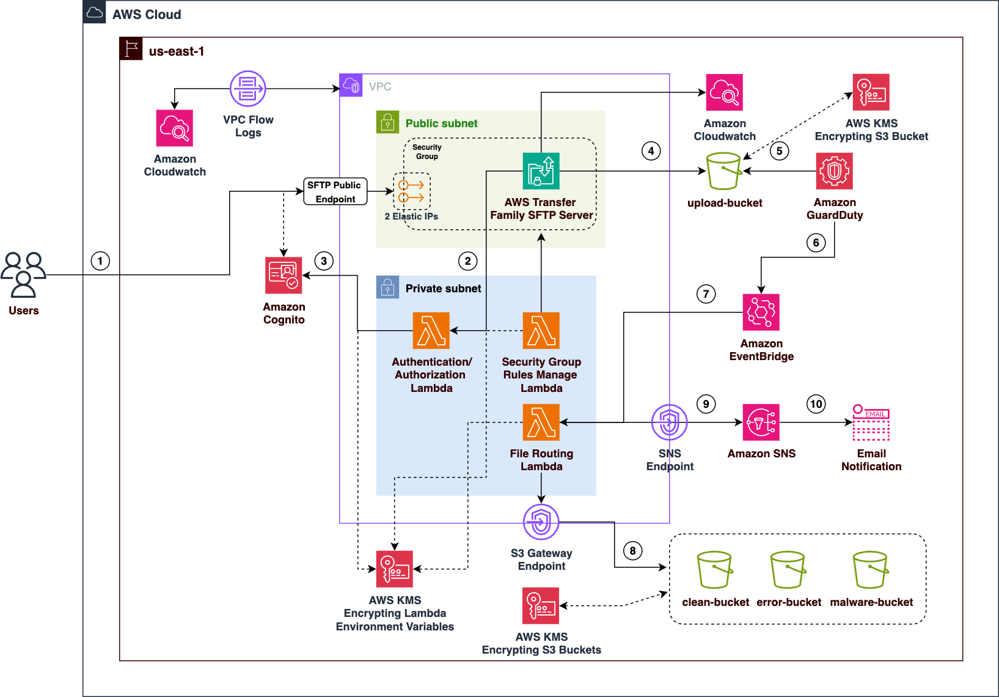

# AWS Transfer Family + GuardDuty Malware Scanning Solution

A comprehensive CloudFormation template that deploys a secure file transfer solution with automated malware scanning and intelligent file routing within a VPC.

## 🏗️ Architecture Overview

  <p align="center">
    
  </p>

This solution provides:
- **Secure SFTP Server** with Cognito authentication via AWS Lambda
- **VPC-based Architecture** with public and private subnets
- **WAF Protection** with custom IP filtering and rate limiting
- **Automated Malware Scanning** using GuardDuty Malware Protection for S3
- **Intelligent File Routing** based on scan results via EventBridge and Lambda
- **Real-time Notifications** for security incidents via SNS
- **KMS Encryption** for all S3 buckets with automatic key rotation
- **VPC Endpoints** for secure AWS service access without internet
- **IP-based Access Control** for both ingress and egress traffic

## 🔍 Detailed Component Architecture

### VPC Network Architecture
The solution deploys a secure VPC with the following components:

- **VPC**: A dedicated VPC with CIDR block 10.0.0.0/16 (configurable)
- **Subnets**:
  - **Public Subnets**: Two public subnets (10.0.1.0/24, 10.0.2.0/24) in different AZs for high availability
  - **Private Subnets**: Two private subnets (10.0.3.0/24, 10.0.4.0/24) in different AZs for Lambda functions
- **Internet Gateway**: Provides internet access for public subnets
- **NAT Gateway**: Allows outbound internet access from private subnets
- **Route Tables**: Separate route tables for public and private subnets
- **VPC Flow Logs**: Captures network traffic information for security analysis with 14-day retention
- **Security Groups**:
  - **Transfer Security Group**: Controls access to the SFTP server
  - **Lambda Security Group**: Controls network access for Lambda functions
  - **VPC Endpoint Security Groups**: Control access to VPC endpoints

### VPC Endpoints
The solution creates the following VPC endpoints to enable secure communication without traversing the internet:

- **S3 Gateway Endpoint**: Allows access to S3 buckets from within the VPC
- **SNS Interface Endpoint**: Enables Lambda functions to publish to SNS topics
- **CloudWatch Logs Interface Endpoint**: Allows Lambda functions to send logs to CloudWatch
- **EC2 Interface Endpoint**: Enables Lambda functions to interact with EC2 API
- **CloudFormation Interface Endpoint**: Enables Lambda functions to interact with CloudFormation API

### AWS Transfer Family Configuration
The solution deploys a secure SFTP server with the following components:

- **VPC-based SFTP Server**: Deployed in public subnets with Elastic IPs for high availability
- **Custom Authentication**: Uses Lambda function to authenticate users against Cognito User Pool
- **Security Policy**: Uses `TransferSecurityPolicy-2020-06` for secure SFTP connections
- **Protocol**: SFTP only (port 22)
- **Logging**: CloudWatch logging enabled via Transfer logging role
- **Home Directory**: User's home directory is mapped to the upload bucket
- **Access Control**: Users can only access their designated S3 bucket with least privilege permissions

### Authentication Flow
1. User connects to SFTP server with username and password
2. Transfer Family invokes the Authentication Lambda function
3. Lambda authenticates the user against Cognito User Pool
4. If successful, Lambda returns the IAM role and home directory mapping
5. Transfer Family assumes the role and provides access to the user
6. User can now upload files to the designated S3 bucket

### Cognito User Pool Configuration
- **User Pool**: Named `SFTPUserPool-${AWS::AccountId}`
- **Client**: Named `SFTPClient-${AWS::AccountId}`
- **Authentication Flows**: User password and admin authentication enabled
- **Password Policy**: Minimum 8 characters with uppercase, lowercase, numbers, and symbols
- **WAF Protection**: Web ACL associated with the User Pool for additional security
- **Email Verification**: Email verification required for new users

### WAF Protection Configuration
The solution implements a comprehensive WAF protection layer with the following components:

- **Regional Web ACL**: Named `latest-TransferFamilyProtection` with detailed logging to CloudWatch
- **Custom IP Set Rule**: Configurable to either ALLOW or BLOCK specified IP addresses (priority 0)
- **Rate Limiting Rule**: Limits requests to 100 per IP address to prevent brute force attacks (priority 1)
- **AWS Managed Rule Sets**:
  - **Common Rule Set**: Provides protection against common web exploits (priority 2)
  - **Known Bad Inputs**: Blocks requests with known malicious patterns (priority 3)
  - **Amazon IP Reputation List**: Blocks requests from IPs with poor reputation (priority 4)
  - **Anonymous IP List**: Blocks requests from anonymous proxy services (priority 5)
- **WAF Logging**: All WAF events are logged to a dedicated CloudWatch log group with 7-day retention
- **Association**: The WAF Web ACL is associated with the Cognito User Pool to protect authentication

### S3 Security
- **KMS encryption** at rest with automatic key rotation (365 days)
- **Versioning enabled** on all primary buckets for data protection and recovery
- **Public access blocked** on all buckets through comprehensive bucket policies
- **Secure transport required** (HTTPS/TLS only) enforced through explicit deny policies
- **Account-specific bucket names** to prevent conflicts using `${AWS::AccountId}` suffix
- **Dedicated access logging buckets** for each primary bucket with separate retention policies:
  - **Upload Bucket**: `${UploadBucketName}-access-logs-${AWS::AccountId}`
  - **Clean Bucket**: `${CleanBucketName}-access-logs-${AWS::AccountId}`
  - **Malware Bucket**: `${MalwareBucketName}-access-logs-${AWS::AccountId}`
  - **Error Bucket**: `${ErrorBucketName}-access-logs-${AWS::AccountId}`
- **Lifecycle policies** for automated data management and cost optimization:
  - Primary buckets: 90-day retention for noncurrent versions
  - Access logs: 90-day retention with transition to STANDARD_IA after 30 days and GLACIER after 60 days
- **Intelligent tiering** and archival to Glacier for long-term storage:
  - STANDARD_IA after 30 days
  - INTELLIGENT_TIERING after 90 days
  - GLACIER after 180 days
- **Bucket policies** that enforce least privilege access for Lambda functions and Transfer users

### Malware Scanning and File Routing
The solution implements automated malware scanning and intelligent file routing with these components:

- **GuardDuty Malware Protection**: Automatically scans files uploaded to the upload bucket
- **EventBridge Rule**: Captures GuardDuty Malware Protection scan result events
- **File Routing Lambda**: Processes scan results and routes files to appropriate buckets
- **SNS Notifications**: Sends real-time alerts when malware is detected

#### File Routing Logic
```
# Scan Result → Destination
NO_THREATS_FOUND → Clean Bucket (with KMS encryption)
THREATS_FOUND → Malware Bucket + SNS Alert (with KMS encryption)
UNSUPPORTED → Error Bucket (with KMS encryption)
ACCESS_DENIED → Error Bucket (with KMS encryption)
FAILED → Error Bucket (with KMS encryption)
```

### IP-Based Access Control
The solution provides two layers of IP-based access control:

- **WAF IP Set**: Controls access at the application layer through the WAF Web ACL
  - Can be configured to either ALLOW or BLOCK specified IPs
  - Applied to the Cognito User Pool to protect authentication
  - Logs all actions to CloudWatch

- **Security Group Rules**: Controls access at the network layer
  - Dynamically managed by a Lambda function
  - Supports both ingress (inbound) and egress (outbound) traffic control
  - Configurable to restrict outbound traffic to specific IPs
  - Custom Lambda function updates rules based on CloudFormation parameters

### KMS Encryption Configuration
The solution uses a dedicated KMS key for encryption with the following features:

- **Key Alias**: `alias/TransferFamily-KMS-Key`
- **Automatic Key Rotation**: Enabled with 365-day rotation period
- **Pending Window**: 30 days for key deletion
- **Key Policy**: Grants permissions to:
  - Root account for administrative access
  - CloudWatch Logs for log encryption
  - Lambda for environment variable encryption
  - S3 for bucket encryption
  - Transfer Family for file access

### Lambda Functions
The solution includes several Lambda functions that work together:

#### Authentication Lambda
- **Purpose**: Authenticates SFTP users against Cognito User Pool
- **Runtime**: Python 3.12
- **VPC Configuration**: Runs in private subnets
- **Environment Variables**:
  - USER_POOL_ID: Cognito User Pool ID
  - CLIENT_ID: Cognito User Pool Client ID
  - UPLOAD_BUCKET: Upload bucket name
  - AWS_ACCOUNT_ID: AWS Account ID
  - AWS_STACK_NAME: CloudFormation stack name
- **Functionality**:
  - Receives username/password from Transfer Family
  - Authenticates against Cognito User Pool
  - Returns IAM role and home directory mapping if successful

#### File Routing Lambda
- **Purpose**: Routes files based on malware scan results
- **Runtime**: Python 3.12
- **VPC Configuration**: Runs in private subnets
- **Environment Variables**:
  - UPLOAD_BUCKET: Upload bucket name
  - CLEAN_BUCKET: Clean files bucket name
  - MALWARE_BUCKET: Malware files bucket name
  - ERROR_BUCKET: Error files bucket name
  - SNS_TOPIC_ARN: SNS topic ARN for notifications
  - KMS_KEY_ID: KMS key ID for encryption
- **Functionality**:
  - Processes GuardDuty Malware Protection scan results
  - Moves files to appropriate buckets based on scan results
  - Sends SNS notifications for malware detections

#### Security Group Rules Lambda
- **Purpose**: Dynamically manages security group rules
- **Runtime**: Python 3.12
- **VPC Configuration**: Runs in private subnets
- **Functionality**:
  - Adds/removes ingress rules for allowed IP addresses
  - Optionally manages egress rules for the same IP addresses
  - Handles CloudFormation create/update/delete events

### EventBridge Integration
The solution uses EventBridge to connect GuardDuty Malware Protection with the File Routing Lambda:

- **Rule Pattern**: Captures GuardDuty Malware Protection scan result events
- **Target**: File Routing Lambda function
- **Event Source**: aws.guardduty
- **Detail Type**: GuardDuty Malware Protection Object Scan Result
- **Filter**: Only processes events for the upload bucket

## 📋 Prerequisites

- AWS Account with appropriate permissions (Administrator access recommended for deployment)
- **GuardDuty enabled** in your AWS account with the latest features
- **GuardDuty Malware Protection for S3** enabled in your account
  - This can be enabled in the GuardDuty console under "Protection Plans"
  - Required for automated malware scanning functionality
- Valid email address for security notifications (will receive malware alerts)
- List of allowed IP addresses/CIDR blocks for access control (optional)
- Sufficient VPC limits in your account (the solution creates a new VPC)
- Sufficient EIP limits (the solution uses 3 Elastic IPs - 1 for NAT Gateway, 2 for Transfer endpoints)

## 🚀 Quick Start

### 1. Deploy the Stack

```bash
# Clone the repository or download the template file
# Make sure you're using the correct template filename (waf-transfer-family-template.yml)

aws cloudformation create-stack \
  --stack-name malware-scanning-sftp \
  --template-body file://waf-transfer-family-template.yml \
  --parameters \
    ParameterKey=SecurityTeamEmail,ParameterValue=your-email@company.com \
    ParameterKey=AllowedIPAddresses,ParameterValue=\"192.168.1.1/32,10.0.0.0/24\" \
    ParameterKey=IPSetAction,ParameterValue=Allow \
    ParameterKey=EnableEgressRules,ParameterValue=true \
    ParameterKey=VpcCIDR,ParameterValue=10.0.0.0/16 \
  --capabilities CAPABILITY_NAMED_IAM

# Monitor the stack creation progress
aws cloudformation describe-stacks \
  --stack-name malware-scanning-sftp \
  --query 'Stacks[0].StackStatus'
```

The deployment typically takes 15-20 minutes to complete due to the creation of VPC endpoints and other resources.

### 2. Create Cognito Users

After deployment, create users in the Cognito User Pool:

```bash
# Get the User Pool ID from stack outputs
USER_POOL_ID=$(aws cloudformation describe-stacks \
  --stack-name malware-scanning-sftp \
  --query 'Stacks[0].Outputs[?OutputKey==`UserPoolId`].OutputValue' \
  --output text)

# Create a user
aws cognito-idp admin-create-user \
  --user-pool-id $USER_POOL_ID \
  --username user@company.com \
  --user-attributes Name=email,Value=user@company.com \
  --temporary-password TempPass123! \
  --message-action SUPPRESS

# Set permanent password
aws cognito-idp admin-set-user-password \
  --user-pool-id $USER_POOL_ID \
  --username user@company.com \
  --password YourSecurePassword123! \
  --permanent

# Verify the user was created successfully
aws cognito-idp admin-get-user \
  --user-pool-id $USER_POOL_ID \
  --username user@company.com
```

### 3. Connect via SFTP

```bash
# Get the Transfer Server Endpoint from stack outputs
TRANSFER_ENDPOINT=$(aws cloudformation describe-stacks \
  --stack-name malware-scanning-sftp \
  --query 'Stacks[0].Outputs[?OutputKey==`TransferServerEndpoint`].OutputValue' \
  --output text)

# Connect via SFTP
sftp user@company.com@$TRANSFER_ENDPOINT

# Or use a GUI SFTP client with these settings:
# Host: <TRANSFER_ENDPOINT value>
# Username: user@company.com
# Password: YourSecurePassword123!
# Port: 22
```

### 4. Test File Upload and Malware Scanning

```bash
# Create a test file
echo "This is a test file" > test.txt

# Upload the file via SFTP
sftp user@company.com@$TRANSFER_ENDPOINT << EOF
put test.txt
quit
EOF

# GuardDuty will automatically scan the file
# The File Routing Lambda will move it to the appropriate bucket based on scan results
# You can check the status in CloudWatch Logs
```

## 📈 Monitoring & Logging

### CloudWatch Logs
- **Lambda Functions**: `/aws/lambda/<function-name>`
- **Authentication Lambda**: `/aws/lambda/<stack-name>-AuthLambdaFunction-<id>`
- **File Routing Lambda**: `/aws/lambda/<stack-name>-FileRoutingLambdaFunction-<id>`
- **Transfer Family**: CloudWatch logging enabled
- **WAF Logs**: `<WAFLogGroupName>` (7-day retention, KMS encrypted)
- **S3 Access Logs**: Stored in dedicated logging buckets with lifecycle policies
- **VPC Flow Logs**: Stored in CloudWatch Logs with 14-day retention (configurable)

### SNS Notifications
Malware detection triggers email alerts with:
- File name and location
- Scan result details
- Threat information
- Timestamp

### CloudWatch Metrics
- **WAF Metrics**: Request counts, blocked requests, allowed requests
- **Transfer Family Metrics**: Connection count, file transfer metrics
- **Lambda Metrics**: Invocation count, duration, error count
- **S3 Metrics**: Storage metrics, request counts

## 🛠️ Troubleshooting

### Common Issues

**SFTP Authentication Fails**
- Verify user exists in Cognito User Pool
- Check user status (confirmed/enabled)
- Ensure correct password
- Verify IP is allowed in WAF IP set and security group
- Check Authentication Lambda logs for errors
- Verify Transfer Family service role has correct permissions

**File Upload Access Denied**
- Verify KMS key permissions
- Check S3 bucket policies
- Confirm IAM role permissions
- Verify VPC endpoints are properly configured
- Check Transfer Family service role has correct permissions

**No Malware Scanning**
- Enable GuardDuty in your account
- Enable Malware Protection for S3
- Verify EventBridge rule is active
- Check Lambda function logs for errors
- Verify S3 bucket notifications are configured correctly

**Lambda Function Errors**
- Check VPC configuration
- Verify VPC endpoints are properly configured
- Check IAM permissions
- Review CloudWatch logs for specific errors
- Verify KMS key permissions

**WAF Not Blocking/Allowing Traffic**
- Check WAF Web ACL configuration
- Verify IP set contains correct IP addresses
- Check WAF logs for request details
- Verify WAF Web ACL association with Cognito User Pool

### Useful Commands

```bash
# Check stack status
aws cloudformation describe-stacks --stack-name malware-scanning-sftp

# List Cognito users
aws cognito-idp list-users --user-pool-id <USER_POOL_ID>

# View Lambda logs
aws logs describe-log-groups --log-group-name-prefix /aws/lambda/

# Check GuardDuty status
aws guardduty list-detectors

# View WAF logs for blocked requests
aws logs filter-log-events \
  --log-group-name "aws-waf-logs-malware-scan" \
  --filter-pattern '{ $.action = "BLOCK" }' \
  --max-items 10

# Check security group rules
aws ec2 describe-security-groups \
  --group-ids <SECURITY_GROUP_ID> \
  --output table

# Check Transfer Server status
aws transfer describe-server \
  --server-id <SERVER_ID>

# List files in S3 buckets
aws s3 ls s3://<BUCKET_NAME>/ --recursive

# Check EventBridge rule
aws events describe-rule \
  --name <RULE_NAME>
```

## 📝 Stack Outputs

After deployment, the stack provides:
- **TransferServerEndpoint**: SFTP server URL
- **UploadBucket**: Upload S3 bucket name
- **CleanBucket**: Clean files S3 bucket name
- **MalwareBucket**: Malware files S3 bucket name
- **ErrorBucket**: Error files S3 bucket name
- **UserPoolId**: Cognito User Pool ID
- **VpcId**: VPC ID
- **PublicSubnets**: Public subnet IDs
- **PrivateSubnets**: Private subnet IDs
- **WAFIPSetId**: WAF IP set ID
- **WAFWebACLId**: WAF Web ACL ID

## 🧹 Cleanup

```bash
# Delete stack (will retain S3 buckets with data)
aws cloudformation delete-stack --stack-name malware-scanning-sftp

# Manually delete S3 buckets if needed (replace with actual bucket names)
# Primary buckets
aws s3 rb s3://upload-bucket-malware-scan-<ACCOUNT-ID> --force
aws s3 rb s3://clean-bucket-malware-scan-<ACCOUNT-ID> --force
aws s3 rb s3://malware-bucket-malware-scan-<ACCOUNT-ID> --force
aws s3 rb s3://error-bucket-malware-scan-<ACCOUNT-ID> --force

# Access logging buckets
aws s3 rb s3://upload-bucket-malware-scan-access-logs-<ACCOUNT-ID> --force
aws s3 rb s3://clean-bucket-malware-scan-access-logs-<ACCOUNT-ID> --force
aws s3 rb s3://malware-bucket-malware-scan-access-logs-<ACCOUNT-ID> --force
aws s3 rb s3://error-bucket-malware-scan-access-logs-<ACCOUNT-ID> --force

# Note: KMS key will be scheduled for deletion (7-30 day waiting period)
# CloudWatch log groups will be deleted with the stack
```

## 📞 Support

For issues or questions:
1. Check CloudWatch logs for error details
2. Verify GuardDuty configuration
3. Review IAM permissions
4. Check S3 bucket policies
5. Verify VPC endpoint configurations
6. Check security group rules

## 🔐 Security Best Practices

- Regularly rotate Cognito user passwords and enable MFA
- Monitor CloudWatch logs for suspicious activity
- Review SNS notification logs
- Keep WAF rules updated
- Update allowed IP addresses as needed
- Enable AWS Config for compliance monitoring
- Monitor KMS key usage and rotation
- Review S3 access logs regularly for unauthorized access
- Implement least privilege access for all IAM roles

---

**Note**: This solution requires GuardDuty Malware Protection to be enabled in your AWS account for automated scanning functionality.
